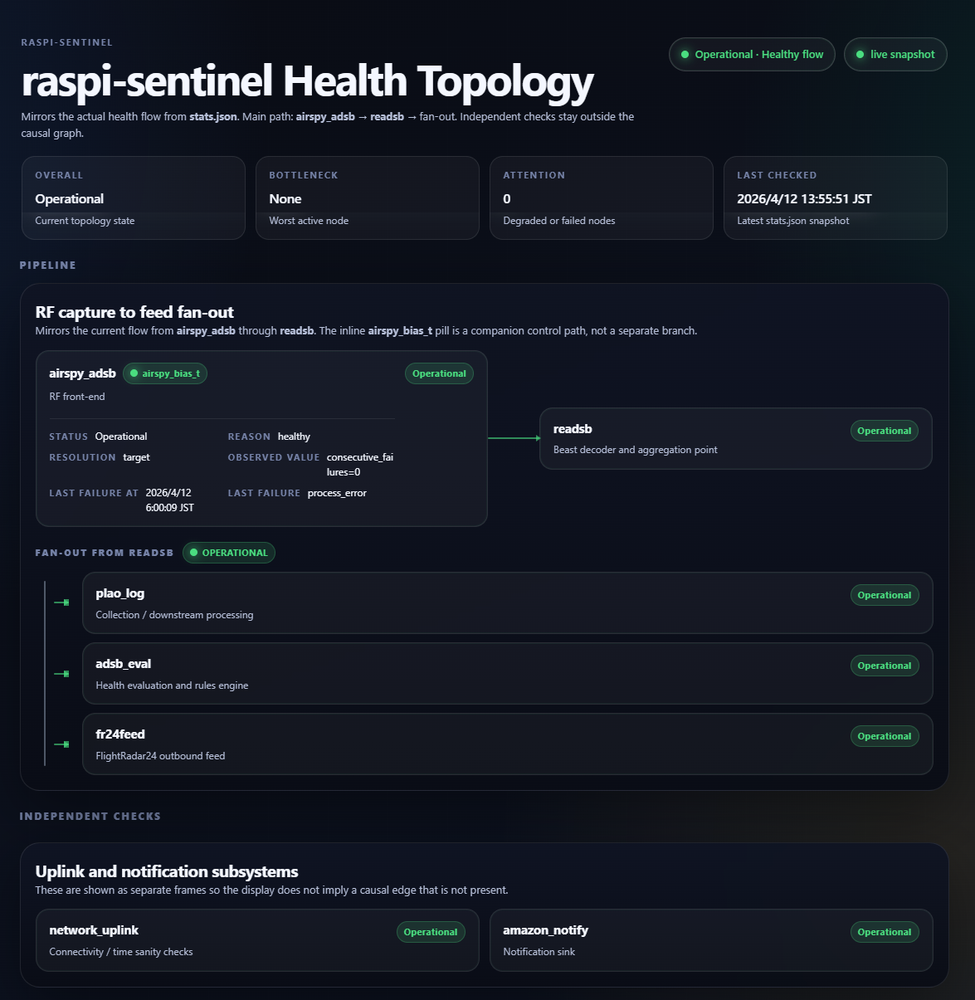

# raspi-sentinel

Logical recovery layer for Raspberry Pi services managed by systemd.

Detects stuck processes, stale outputs, DNS failures, and clock anomalies — then applies staged, inspectable recovery: warn → restart → reboot.

**Used in production** on a Raspberry Pi managing ADS-B and network services.

---

## Why this exists

Most Raspberry Pi failures aren't kernel panics. They're logical stalls: a service is "running" but stopped producing output, a dependency went down, or the wall clock jumped. `systemd` alone can't see these — it only knows whether a process is alive.

raspi-sentinel sits above systemd and below a hardware watchdog, filling the gap between "process exists" and "service is actually working."

## Recovery flow

```
Per target, every cycle:
  evaluate checks
  │
  ├─ healthy → reset failure counters
  └─ unhealthy → increment failure counters
       │
       ├─ below restart_threshold → warn
       ├─ ≥ restart_threshold     → restart services
       └─ ≥ reboot_threshold      → reboot (only if all guards pass)
```

Reboot guards: minimum uptime, cooldown window, rolling reboot cap, per-reason restrictions.

## What it checks

Per target, raspi-sentinel evaluates a configurable set of checks each cycle:

- **Service active status** — is the systemd unit actually running?
- **Heartbeat / output file freshness** — is the service still producing output?
- **Command exit status** — does an arbitrary health-check command succeed?
- **Semantic stats** — `updated_at`, `last_input_ts`, `last_success_ts`, `records_processed_total` from a target's `stats.json`
- **Dependency path** — DNS resolution and gateway reachability, checked separately
- **Clock health** — wall-clock freeze, jump, and optional HTTP Date skew detection

## Core design decisions

**Status and reason are separated.**
A target can be `failed` for different reasons — `dns_error`, `stats_stale`, `clock_jump` — and the recovery policy depends on *why* it failed, not just *that* it failed. DNS-only failures don't escalate to reboot. Clock anomalies require consecutive confirmation before action.

**Three data surfaces, not one.**
Runtime state (failure counters, reboot history) lives in `state.json`. Transitions and actions are append-only in `events.jsonl`. The current aggregate snapshot is `stats.json`. Each serves a different role: `state.json` is what the monitor remembers across cycles, `events.jsonl` is what changed and why, `stats.json` is what the current monitor state is.

**Semantic health over process health.**
Targets can expose a `stats.json` with fields like `last_input_ts`, `last_success_ts`, and `records_processed_total`. This means raspi-sentinel can distinguish "receiving data but failing to process it" from "not receiving data at all" — something a PID check will never tell you.

**Reboot is gated, not automatic.**
Minimum uptime, cooldown windows, rolling reboot caps, and per-reason guards all must pass before a reboot is issued. The goal is to make reboot the last resort and to make the decision auditable.

**Watchdog is explicitly out of scope.**
Hardware watchdog integration exists as an optional layer (`docs/watchdog.md`), but it's separated from core logic. raspi-sentinel handles logical recovery; the watchdog handles "the whole OS is unresponsive." Mixing the two creates unclear failure boundaries.

> Full design rationale: [`docs/principles/engineering-decisions.md`](docs/principles/engineering-decisions.md)
> Recovery boundary philosophy: [`docs/principles/recovery-philosophy.md`](docs/principles/recovery-philosophy.md)

## Example downstream use

The machine-readable outputs of raspi-sentinel can be consumed by operator-facing tools.
The screenshot below shows an internal health-topology view built on top of `stats.json`.



## Testing

Tests prioritize recovery policy correctness over coverage breadth.

Priority scenarios include: systemd active-check failure triggering restart, `updated_at` going stale, DNS-only failure *not* escalating to reboot, fresh input with stale success indicating a processing failure, and malformed JSON failing safe as unhealthy.

```bash
pytest --cov=raspi_sentinel.checks --cov=raspi_sentinel.recovery --cov-branch
```

## Quick start

```bash
git clone https://github.com/yukimurata0421/raspi-sentinel.git
cd raspi-sentinel
python3 -m pip install .

sudo install -d -m 0755 /etc/raspi-sentinel
sudo install -m 0644 config/raspi-sentinel.example.toml /etc/raspi-sentinel/config.toml
# edit config for your environment

sudo install -d -m 0755 /var/lib/raspi-sentinel
sudo install -m 0644 systemd/raspi-sentinel.service /etc/systemd/system/
sudo install -m 0644 systemd/raspi-sentinel.timer /etc/systemd/system/
sudo systemctl daemon-reload
sudo systemctl enable --now raspi-sentinel.timer
```

Validate and dry-run:

```bash
raspi-sentinel -c /etc/raspi-sentinel/config.toml validate-config
sudo raspi-sentinel -c /etc/raspi-sentinel/config.toml --dry-run --verbose run-once
```

## Documentation

| Document | Purpose |
|----------|---------|
| [`docs/README.md`](docs/README.md) | Documentation index |
| [`docs/facts/operations-runbook.md`](docs/facts/operations-runbook.md) | Operator runbook |
| [`docs/facts/data-contracts.md`](docs/facts/data-contracts.md) | Data surface contracts |
| [`docs/time-health-decision-table.md`](docs/time-health-decision-table.md) | Clock anomaly decision policy |
| [`docs/principles/engineering-decisions.md`](docs/principles/engineering-decisions.md) | Design rationale |
| [`docs/principles/recovery-philosophy.md`](docs/principles/recovery-philosophy.md) | Recovery boundary and intent |
| [`docs/watchdog.md`](docs/watchdog.md) | Optional watchdog integration |

## Requirements

Python 3.11+. MIT licensed.